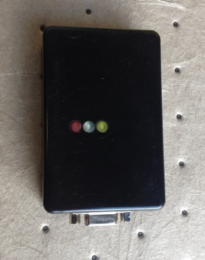
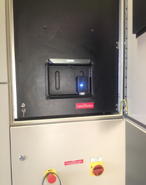
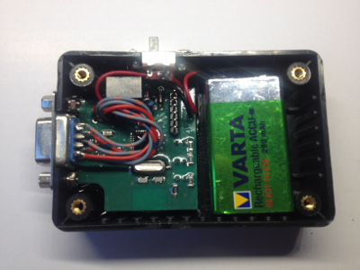

# RS485 to Bluetooth Hardware Interface

- Connect a RS485 serial interface to a Bluetooth device (like a smartphone);
- Fully programmable function thanks to an ATMEGA microcontroller, easily accessible through 6-pin header;
- Industrial-grade components with lot of redundancy;
- Originally developed as the hardware companion for my [BTDisplay - controlling a Siemens wind turbine with my smartphone](https://github.com/holodon/BTDisplayOSS);
- General purpose LED;
- Rechargeable battery with a simple but effective charging circuit;
- Really small form factor - pictures available in the [media section](media).

## Legal
- Open-source hardware, released under [MIT](LICENSE) license;
- Layout and schematics build with [EAGLE CAD](https://www.autodesk.com/products/eagle/overview).

## 

    <a href="https://vlzware.com">Vladimir Zhelezarov</a> © 2017

